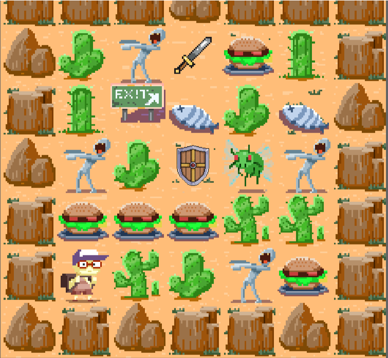
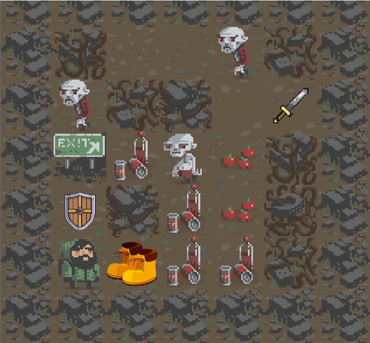
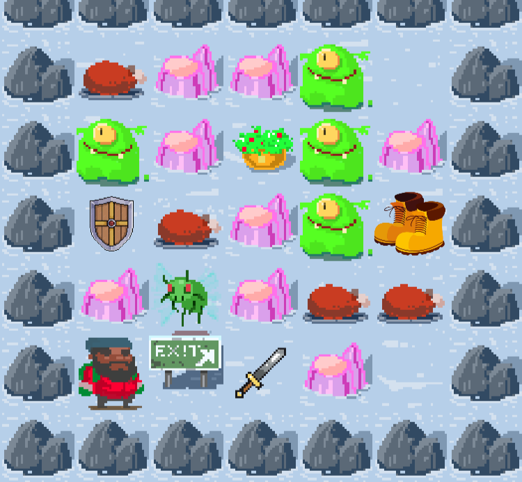

# 🎮 Roguelike Mastery: Build Your Dungeon 🏰

Welcome to **Roguelike Mastery**! This is an exciting 2D Roguelike game developed in Unity, where you will explore procedurally generated dungeons, face challenging enemies, and collect items to improve your character. 🌟

 
---

## 🚀 Key Features

- **🌵 Three Unique Themes:** Explore unique biomes: **Sand**, **Urban**, and **Snow**, each with its own visual style and challenges.
- **🛠️ Turn-Based System:** A strategic turn-based system that allows you to plan your moves and actions.
- **🎨 Retro Pixel Art:** Pixel art graphics that evoke nostalgia and retro charm.
- **⚔️ Character Upgrades:** Increase your character's strength, speed, defense, and health to survive the dungeon.
- **💀 Dynamic Game Over:** When you lose, the game automatically returns to the main menu after 5 seconds.
- **🧩 Procedural Generation:** Dynamically generated dungeons with walls, enemies, food, and special items.

---

## 🛠️ System Requirements

- **Unity 2021.3 or higher** 🎮
- **Visual Studio 2022** (or any compatible code editor) 💻
- **Git** (to clone the repository) 📦

---

## 📥 Installation

1. Clone the repository to your local machine:
   ```
   git clone https://github.com/your-username/roguelike-mastery.git
   ```
2. Open the project in Unity.
3. Navigate to the `MainScene` and press **Play** to start.

---

## 🎯 How to Play

- **Movement:** Use the arrow keys or `WASD` to move through the dungeon.
- **Interaction:** Press the spacebar to interact with objects and enemies.
- **Objective:** Survive as long as possible, defeat enemies, and progress through the levels.

---

## 🖼️ Screenshots

| Sand Theme 🌵 | Urban Theme 🏙️ | Snow Theme ❄️ |
|---------------|----------------|---------------|
|  |  |  |

---

## 📂 Project Structure

```
Roguelike-Mastery/
├── Assets/
│   ├── Scripts/          # All C# scripts
│   ├── Scenes/           # Game scenes (MainScene, SandTheme, etc.)
│   ├── Sprites/          # Pixel art assets
│   └── Prefabs/          # Object and character prefabs
├── Docs/                 # Additional documentation
└── README.md             # This file
```

---

## 🧩 Key Implementations

### **1. Singleton Pattern**
- **Used in `GameManager` and `ObjectMove`:**  
  The Singleton pattern ensures that only one instance of `GameManager` and `ObjectMove` exists throughout the game. This provides global access to these classes without additional references.
  ```csharp
  public static GameManager Instance { get; private set; }

  private void Awake()
  {
      if (Instance == null)
      {
          Instance = this;
          DontDestroyOnLoad(gameObject);
      }
      else
      {
          Destroy(gameObject);
      }
  }
  ```

### **2. A* Pathfinding Algorithm**
- **Implemented in `Enemy`:**  
  Enemies use the A* algorithm to find the optimal path to the player. This algorithm evaluates adjacent cells and selects the shortest path based on a heuristic cost.
  ```csharp
  private List<Vector2Int> FindPath(Vector2Int start, Vector2Int target)
  {
      var openSet = new List<Vector2Int>();
      var closedSet = new HashSet<Vector2Int>();
      var cameFrom = new Dictionary<Vector2Int, Vector2Int>();
      var gScore = new Dictionary<Vector2Int, float>();
      var fScore = new Dictionary<Vector2Int, float>();

      openSet.Add(start);
      gScore[start] = 0;
      fScore[start] = Heuristic(start, target);

      while (openSet.Count > 0)
      {
          var current = openSet[0];
          for (int i = 1; i < openSet.Count; i++)
          {
              if (fScore[openSet[i]] < fScore[current])
              {
                  current = openSet[i];
              }
          }

          if (current == target)
          {
              return ReconstructPath(cameFrom, current);
          }

          openSet.Remove(current);
          closedSet.Add(current);

          foreach (var neighbor in GetNeighbors(current))
          {
              if (closedSet.Contains(neighbor)) continue;

              var tentativeGScore = gScore[current] + 1;

              if (!openSet.Contains(neighbor) || tentativeGScore < gScore[neighbor])
              {
                  cameFrom[neighbor] = current;
                  gScore[neighbor] = tentativeGScore;
                  fScore[neighbor] = gScore[neighbor] + Heuristic(neighbor, target);

                  if (!openSet.Contains(neighbor))
                  {
                      openSet.Add(neighbor);
                  }
              }
          }
      }
      return null;
  }
  ```

### **3. Smooth Movement with Coroutines**
- **Implemented in `ObjectMove`:**  
  A coroutine is used to move objects (like the player and enemies) smoothly between cells. This enhances the visual experience of the game.
  ```csharp
  public IEnumerator SmoothMove(Transform objectTransform, Vector3 targetPosition, float moveSpeed)
  {
      Vector3 startPosition = objectTransform.position;
      float elapsedTime = 0;

      while (elapsedTime < 1f / moveSpeed)
      {
          objectTransform.position = Vector3.Lerp(startPosition, targetPosition, elapsedTime * moveSpeed);
          elapsedTime += Time.deltaTime;
          yield return null;
      }

      objectTransform.position = targetPosition;
  }
  ```

### **4. Turn-Based System**
- **Implemented in `TurnManager`:**  
  A turn-based system that advances the game state in discrete intervals. Enemies and game events are updated on each turn.
  ```csharp
  public class TurnManager
  {
      public event Action OnTick;
      private int m_CurrentTurn = 0;

      public void Tick()
      {
          m_CurrentTurn++;
          OnTick?.Invoke();
      }
  }
  ```

### **5. Procedural Dungeon Generation**
- **Implemented in `BoardManager`:**  
  Dungeons are dynamically generated with walls, enemies, food, and special items. Each level increases in difficulty and size.
  ```csharp
  public void Init(int level)
  {
      Width = BaseWidth + (level * LevelScaleFactor);
      Height = BaseHeight + (level * LevelScaleFactor);
      m_BoardData = new CellData[Width, Height];

      for (int y = 0; y < Height; ++y)
      {
          for (int x = 0; x < Width; ++x)
          {
              if (x == 0 || y == 0 || x == Width - 1 || y == Height - 1)
              {
                  m_BoardData[x, y].Passable = false; // Walls
              }
              else
              {
                  m_BoardData[x, y].Passable = true; // Floor
              }
          }
      }
  }
  ```

---

## 🤝 Contributing

Contributions are welcome! If you'd like to improve the project, follow these steps:

1. Fork the repository.
2. Create a new branch (`git checkout -b feature/new-feature`).
3. Make your changes and commit them (`git commit -m 'Add new feature'`).
4. Push to the branch (`git push origin feature/new-feature`).
5. Open a **Pull Request**.

---

## 📜 License

This project is licensed under the **MIT License**. For more details, see the [LICENSE](LICENSE) file.

---

## ✉️ Contact

If you have questions or suggestions, feel free to reach out:

- **Email:** eddiefloat@gmail.com 📧

---

Thanks for visiting **Roguelike Mastery**! We hope you enjoy building and exploring your own dungeon. Good luck! 🎲✨

---

This README highlights the key implementations of the project, such as the Singleton pattern, A* algorithm, and smooth movement with coroutines. Feel free to customize it further to suit your needs! 😊
```


